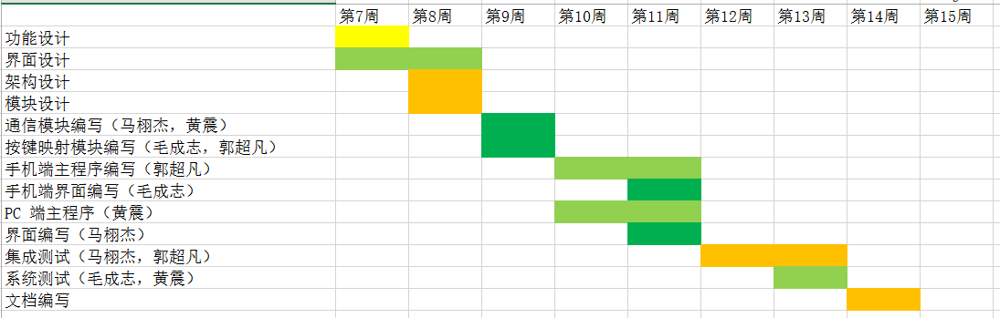

<!-- Link -->
<link rel="stylesheet" type="text/css" href="style.css">

<!-- Main -->

 手机多人体感游戏手柄   开发计划 

 Team 十一 

 马栩杰 黄震 毛成志 郭超凡 

---

## 项目分工与进度

---

## 项目进度

- 第 7 周：功能设计、界面设计
- 第 8 周：架构设计、模块设计
- 第 9 周：通信、按键映射模块编写
- 第 10 周、第 11 周：手机端、PC 端的主程序、界面编写
- 第 12 周、第 13 周：进行集成测试、系统测试
- 第 14 周：完成文档，交付

---

## 项目进度

- 发布版本
  - v0.1 核心通信功能，实现一个命令行程序，PC 端可以接收手机消息（第 9 周）
  - v0.2 手机端程序，可以实现手机按键发送消息（第 10 周）
  - v0.3 PC 端事件功能与多人连接（第 11 周）
  - v0.4 PC 端界面（第 11 周）
  - v0.98 集成测试 （第 13 周）
  - v0.99 文档（第 14 周）
  - v1.0 发布（第 14 周）

---

## 版本控制

- 使用 GitLab 进行版本控制
- 采用 Git Flow 工作流进行开发
- 任务通过 Gitlab Issues 分配
- 使用 Gitlab Issues 在组内报告与处理 bug

---

## 风险控制

- 技术风险
  - 对 Java 开发不熟悉
  - 对 Git Flow 工作流不熟悉
  - 图形界面设计 --> 在系统设计阶段可以先读一些学习资料
- 管理风险
  - 团队沟通不畅 --> 开发中的问题基于 GitLab Issues 进行沟通，保证交流有效
  - 团队成员退课 --> 分工模块化、严格控制开发进度，如果有人中途退出，其他人及时接锅
